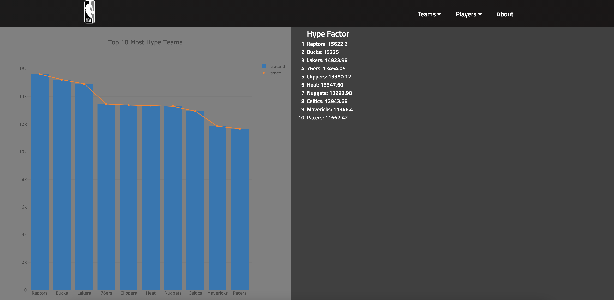
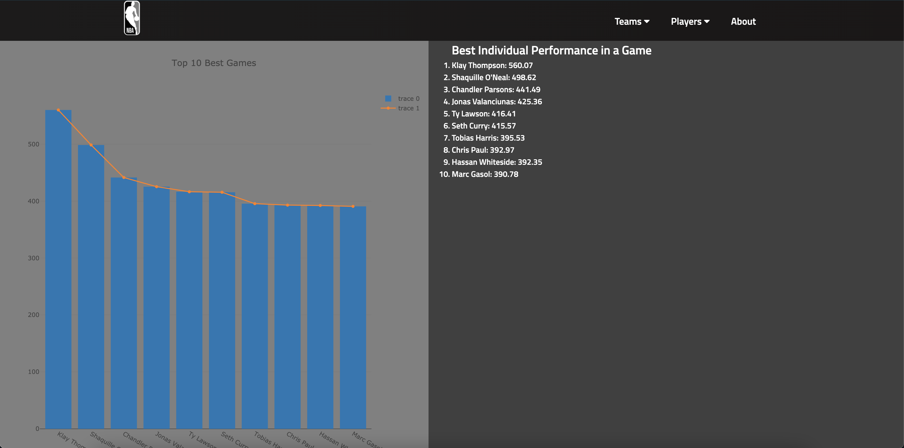

# cs_180_project

For this project my team and I were instructed to create a webiste that was able to display NBA analytics. We used Flask and python for our backend servers to open, read, modify, and display the csv files we were given. Our csv files, games.csv, games_details.csv, teams.csv, rankings.csv, and players.csv all hold information about every game and player in the NBA since 2004. All of these csv files can be found in the dataset folder within the backend folder. The backend folder also holds the backend.py file where we created all functions for analytics. We used React and JavaScript for our frontend to display all the analytics and data that our backend created. All frontend files can be found in the frontend folder. 

This first screenshot is our home page. The NBA logo in the top left corner takes the user back to the home page.

This second screenshot is the main page for our teams analytics. The user is prompted to enter a team's name and a year they played in. The website will then display all the details about each game the entered team has played for that year.

This third screenshot is an example metric that we created for the teams in the NBA.

This fourth screenshot is an example metric that we created for the players in the NBA.

